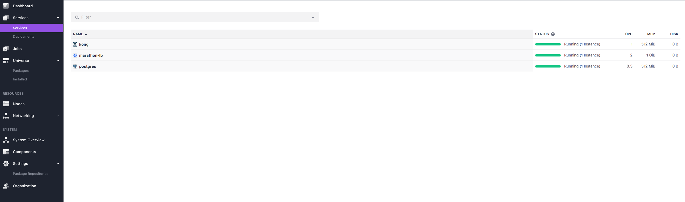
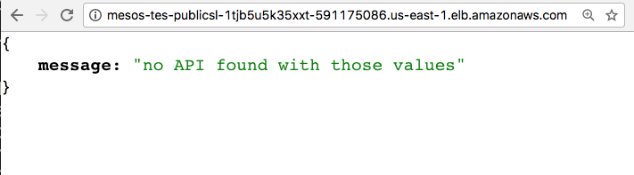

# [KONG][website-url] :heavy_plus_sign: [DCOS Deployment](https://dcos.io/docs/1.9/)

[![Website][website-badge]][website-url]
[![Documentation][documentation-badge]][documentation-url]
[![Mailing List][mailing-list-badge]][mailing-list-url]
[![Gitter Badge][gitter-badge]][gitter-url]

[![][kong-logo]][website-url]

Provision Kong on Mesosphere DC/OS cluster using following steps.

Kong can be provisioned on a Mesosphere DC/OS cluster using following
steps:

The following steps use AWS for provisioning the DC/OS cluster and assumes you 
have basic knowledge of [DC/OS](https://dcos.io/docs/1.9/), 
[Marathon](https://mesosphere.github.io/marathon/), 
[VIPs](https://dcos.io/docs/1.9/networking/load-balancing-vips/virtual-ip-addresses/),
and [Marathon-LB](https://dcos.io/docs/1.9/networking/marathon-lb/).

1. **Initial setup**

    Download or clone the following repo:

    ```bash
    $ git clone git@github.com:Mashape/kong-dist-dcos.git
    $ cd kong-dist-dcos
    ```

    Skip to step 3 if you have already provisioned a DC/OS cluster.

2. **Deploy a DC/OS cluster**

    Following the [DC/OS AWS documentation](https://dcos.io/docs/1.9/installing/cloud/aws/),
    deploy a DC/OS cluster on which Kong will be provisioned
    
    Once your cluster is ready, Kong can be deployed using the
    [DC/OS CLI](https://dcos.io/docs/1.9/cli/) or the
    [DC/OS GUI](https://dcos.io/docs/1.9/gui/).

3. **Deploy Marathon-LB**

    We will use [Marathon-LB](https://dcos.io/docs/1.9/networking/marathon-lb/)
    for load balancing external traffic to cluster. Using the package
    `marathon-lb` deploy the Marathon-LB:

    ```bash
    $ dcos package install marathon-lb
    ```

4. **Deploy a Kong-supported database**

    Before deploying Kong, you need to provision a Cassandra or PostgreSQL
    instance.

    For Cassandra, use the `cassandra` package to deploy 3 nodes of Cassandra
    in the DC/OS cluster:

    ```bash
    $ dcos package install cassandra
    ```

    For PostgreSQL, use the `postgresql` package with following option:

    ```json
    {
      "service": {
        "name": "postgresql"
      },
      "postgresql": {
        "cpus": 0.3,
        "mem": 512
      },
      "database": {
        "username": "kong",
        "password": "kong",
        "dbname": "kong"
      },
      "storage": {
        "host_volume": "/tmp",
        "pgdata": "pgdata",
        "persistence": {
          "enable": true,
          "volume_size": 512,
          "external": {
            "enable": false,
            "volume_name": "postgresql",
            "provider": "dvdi",
            "driver": "rexray"
          }
        }
      },
      "networking": {
        "port": 5432,
        "host_mode": false,
        "external_access": {
          "enable": false,
          "external_access_port": 15432
        }
      }
    }
    ```

    Save above content to a file `postgres.json`. It configures PostgreSQL as follows:

    - `username`: This parameter configures the username for the kong database.
    - `password`: This parameter configures the password for the kong database.
    - `dbname`: This parameter configures the name of the kong database.
    - `persistence`: This parameter enables persistent volumes for postgresql.

    Install postgresql using `postgres.json` file:

    ```bash
    $ dcos package install postgresql --options=postgres.json
    ```

5. **Deploy Kong**

    Now we have an external load balancer and Kong supported datastore running.
    Using the `kong` package from Universe repo, deploy Kong by pasting the
    json below in a file `kong.json`

    ```json
    {
      "service": {
        "name": "kong"
      },
      "configurations": {
        "postgres": {
          "host": "postgresql.marathon.l4lb.thisdcos.directory",
          "port": 5432,
          "database": "kong",
          "user": "kong",
          "password": "kong"
        },
        "cassandra": {
          "use-cassandra": false,
          "contact-points": "node-0.cassandra.mesos, node-1.cassandra.mesos, node-2.cassandra.mesos",
          "port": 9042,
          "keyspace": "kong"
        }
      },
      "networking": {
        "proxy": {
          "external-access": true,
          "virtual-host": "mesos-tes-PublicSl-1TJB5U5K35XXT-591175086.us-east-1.elb.amazonaws.com",
          "https-redirect": false,
          "service-port": 10201
        },
        "admin": {
          "external-access": true,
          "https-redirect": false,
          "service-port": 10202
        }
      }
    }
    ```

    It configures Kong as follows:

    - `postgres.host`: PostgreSQL host name.
    - `postgres.port`: PostgreSQL port.
    - `postgres.database`: PostgreSQL database name.
    - `postgres.user`: PostgreSQL username.
    - `postgres.password`: PostgreSQL password.
    - `cassandra.use-cassandra`: If `true` use `cassandra` as the Kong database.
    - `cassandra.contact-points`: Comma separated list of Cassandra contact points.
    - `cassandra.port`: Port on which Cassandra listening for query.
    - `cassandra.keyspace`: Keyspace to use in Cassandra. Will be created if doesn't exist.
    - `networking.proxy.external-access`: If `true`, allows external access to Kong's proxy port
    - `networking.proxy.virtual-host`: The virtual host address to integrate Kong proxy port with Marathon-lb.
    - `networking.proxy.https-redirect`: If `true`, Marathon-lb redirects HTTP traffic to HTTPS. This requires 'virtual-host' to be set.
    - `networking.proxy.service-port`: Port number to be used for reaching Kong's proxy port from outside of cluster
    - `networking.admin.external-access`: If `true`, allows external access to Kong's admin port
    - `networking.admin.virtual-host`: The virtual host address to integrate Kong admin port with Marathon-lb.
    - `networking.admin.https-redirect`: If `true`, Marathon-lb redirects HTTP traffic to HTTPS. This requires 'virtual-host' to be set.
    - `networking.admin.service-port`: Port number to be used for reaching Kong's admin ssl port from outside of cluster

    Note: Tweak the above configuration based on you datastore choice. 

    Run the following command to add the app:
    
    ```bash
    $ dcos package install kong --options=kong.json
    ```

6. **Verify your deployments**

    To verify that our kong instance is up and running, we can use `dcos task`
    command:

    ```bash
    $ dcos task
    NAME         HOST        USER  STATE  ID
    kong         10.0.1.8   root    R    kong.af46c916-3b55-11e7-844e-52921ef4378d         
    marathon-lb  10.0.4.42  root    R    marathon-lb.d65c3cc3-3b54-11e7-844e-52921ef4378d  
    postgres     10.0.1.8   root    R    postgres.5b0a2635-3b55-11e7-844e-52921ef4378d   
    ```

    Kong in the DC/OS UI

    

7. **Deploy an upstream server**

    For this demo, we created an app which returns `Hello world` on port `8080`.
    Using the `my_app.json` file from the kong-dist-dcos repo, deploy the app in
    the cluster which will act as a backend server to process requests received
    from Kong:

    ```bash
    $ dcos marathon app add my_app.json
    ```

8. **VHOST**

    In this example, public DNS name used is `mesos-tes-PublicSl-1TJB5U5K35XXT-591175086.us-east-1.elb.amazonaws.com`
    for exposing the Kong's proxy port.

    

    Note: Kong returning 404 on proxy port is a valid response as no API
    registered yet with Kong.

9. **Using Kong**
    
    Create an API on Kong:

    ```bash
    $ curl -i -X POST marathon-lb.marathon.mesos:10202/apis \
    --data "name=myapp" \
    --data "hosts=myapp.com" \
    --data "upstream_url=http://myapp.marathon.l4lb.thisdcos.directory:8080"
    HTTP/1.1 201 Created
    ...

    ```

    Make a request to the API:

    ```bash
    $ curl -i -X GET marathon-lb.marathon.mesos:10201 \
    --header "Host:myapp.com"
    HTTP/1.1 200 OK
    ...

    Hello world
    ```

    Quickly learn how to use Kong with the 
    [5-minute Quickstart](https://getkong.org//docs/latest/getting-started/quickstart).


## Benchmarking Kong
  
  We prepared a simple benchmark by comparing performance of Nginx and
  Kong (with Postgres) running on DC/OS cluster. We used
  [Jmeter](http://jmeter.apache.org/usermanual/build-web-test-plan.html) to
  genrate sample requests and collect the performace data. We ran a Kong
  instance with one plugin `basic-auth` and a Nginx instance proxying request to
  host `mockbin.com`. Both Kong and Nginx instance assingned 1 cpu and 1 gb ram.
  We ran the test plan using 25 threads with 400 requests in loop.

### Mesurements

| Proxy   | Samples| Average| Min  | Max   | Std. Dev. | Error %  | Throughput | KB/sec | Avg. Bytes |
|---------|--------|--------|------|-------|-----------|----------|------------|--------|------------|
| Nginx   | 10000  | 202    | 192  | 1000  | 28.34     | 0.00%    | 109.6      | 184.83 | 1727.2     |
| Kong    | 10000  | 207    | 193  | 8574  | 109.46    | 0.00%    | 101.3      | 209.14 | 2113.4     |

## Enterprise Support

Support, Demo, Training, API Certifications and Consulting available 
at http://getkong.org/enterprise.

[kong-logo]: http://i.imgur.com/4jyQQAZ.png
[website-url]: https://getkong.org/
[website-badge]: https://img.shields.io/badge/GETKong.org-Learn%20More-43bf58.svg
[documentation-url]: https://getkong.org/docs/
[documentation-badge]: https://img.shields.io/badge/Documentation-Read%20Online-green.svg
[gitter-url]: https://gitter.im/Mashape/kong
[gitter-badge]: https://img.shields.io/badge/Gitter-Join%20Chat-blue.svg
[mailing-list-badge]: https://img.shields.io/badge/Email-Join%20Mailing%20List-blue.svg
[mailing-list-url]: https://groups.google.com/forum/#!forum/konglayer

